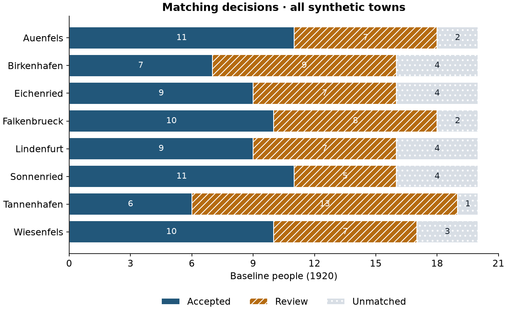
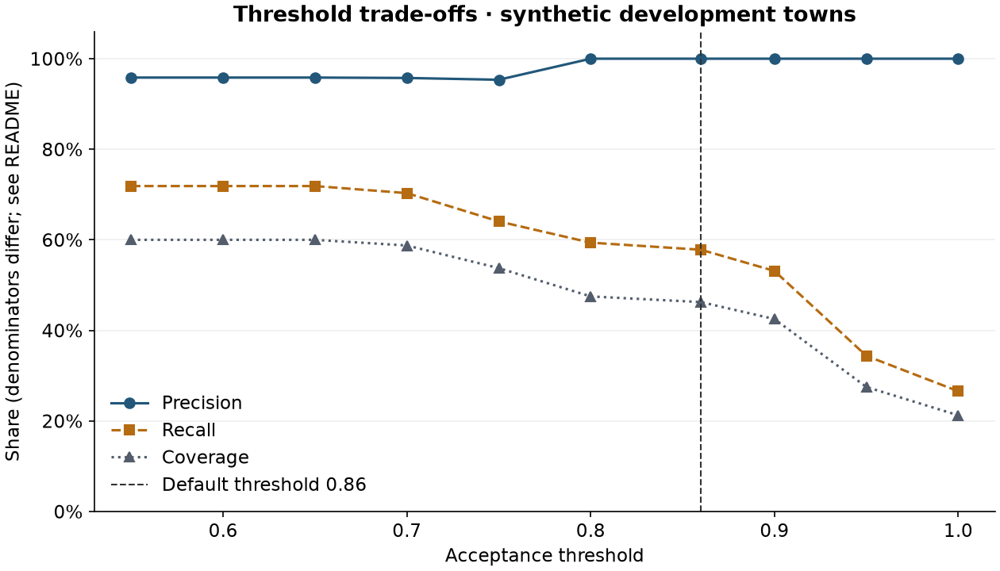

# From historical text to linked records

A small, reproducible Python example: **extract structured records → generate candidate links → make match decisions → evaluate and visualise**.

Start with the **[executed walkthrough and exercises](walkthrough.ipynb)**. It includes saved tables and figures, so it can be read directly on GitHub. The complete pipeline also runs from one command.



## What this demonstrates

The inputs are fictional municipal staff registers for 1920 and 1930, with two text layouts, spelling changes, initials, missing fields and simulated recognition errors. The task is to identify people who appear in both years without forcing uncertain links.

- **Extraction:** parse both layouts; normalise names; preserve raw text, source line and SHA-256; retain rejected lines in an audit table.
- **Record linkage:** generate plausible pairs using town and surname similarity; expose each comparison feature.
- **Match finding:** accept only sufficiently strong, mutually preferred pairs with a clear margin over alternatives. Otherwise retain a review or unmatched decision.
- **Evaluation:** use separate synthetic truth to measure precision, recall, coverage and losses from blocking.
- **Visualisation exercises:** explore threshold trade-offs, compare matching outcomes by town, and widen candidate blocks to recover movers.

This is a new standalone educational implementation inspired by historical administrative record-linkage work in the stability project. **It contains no private research data, copied source files, imports, submodules, credentials or runtime dependencies from that project.** The example was prepared with AI coding assistance for Urs Maier.

## Run it

Tested with **Python 3.13.7**. Use Python 3.13 and an isolated environment:

```bash
python -m venv .venv
# Windows PowerShell:
.venv\Scripts\Activate.ps1
# macOS/Linux alternative: source .venv/bin/activate
python -m pip install -r requirements.txt
python run.py
python -m unittest -v
```

After dependencies are installed, all computation is offline. No API key, OCR engine or private repository is required. The extraction/linkage modules and tests themselves use only Python's standard library; Matplotlib produces the figures, and pandas/Jupyter packages support the walkthrough.

To regenerate the included synthetic inputs and results deterministically:

```bash
python run.py --regenerate
```

The CLI defaults are relative to the script, so it can also be invoked from another working directory. `--data PATH` and `--output PATH` select alternative locations. Re-running replaces the named demonstration output files; `--regenerate` additionally replaces the generated input pages and truth file in the selected data directory.

Open `walkthrough.ipynb` in a notebook editor using this Python environment. To execute it and create an HTML view without an editor, run from the repository root:

```bash
python -m jupyter nbconvert --execute --to notebook --inplace walkthrough.ipynb
python -m jupyter nbconvert --to html walkthrough.ipynb --output preview.html
```

## Data and extraction

`synthetic.py` generates 16 text pages: eight fictional towns × two years, with 20 people per page. There are **320 valid person rows and 16 deliberately unparseable fragments**. The fixed seed is `20260916`.

Each town starts with 20 people. Four leave, 14 remain in the same town, two move to another town, and four entrants appear. Two distinct people per town share indistinguishable observed details. Movements stay inside the same development/held-out group. Names and places are invented combinations, not records of actual individuals.

The extraction starts from **OCR-like text**, not scanned images: this demo does not run an OCR or language model. The two intentionally bounded layouts make parsing inspectable. Unsupported names/layouts and invalid birth years become visible rejection records rather than guessed values. The original text is never overwritten.

| Field | Meaning |
|---|---|
| `record_id` | Source filename + physical line number; stable for the unchanged source |
| `year`, `town` | Register metadata; `town` is the blocking variable |
| `name_raw`, `given`, `surname` | Original name plus normalised components |
| `birth`, `role`, `address` | Extracted evidence; missing birth/address are empty, not zero |
| `source_file`, `source_line`, `source_sha256`, `raw_text` | Exact source provenance |
| `quality_flags` | Explicit missingness/initial flags |

`data/truth.csv` maps baseline source IDs to later source IDs; an empty later ID means no true continuation. It is generated separately and is read **only after** extraction and matching. Identity labels are not embedded in the text or supplied to the matching functions.

## Linking rules

Candidate pairs must be in the same town and have surname similarity of at least 0.55. Comparisons use `difflib.SequenceMatcher`; the score is:

```text
0.45 × surname similarity + 0.25 × given-name similarity
+ 0.20 × birth-year agreement + 0.05 × role similarity
+ 0.05 × address similarity
```

Compatible initials receive 0.65 given-name similarity. Missing fields contribute no positive evidence; weights are not redistributed. The score is an illustrative ranking rule, **not a calibrated match probability**. It does not model population name frequencies, spelling-specific error rates or correlated fields.

Default acceptance requires score ≥ 0.86, mutual first choice, and a ≥ 0.08 score gap to the next candidate on **both** sides. Exact ties never pass. A target cannot be assigned to two people. This conservative rule is not a globally optimal assignment algorithm.

In `outputs/matches.csv`, `right_id` is populated only for accepted links. `best_candidate_id` is a proposal, not an established identity. `review` means unresolved evidence; `unmatched` means no candidate or a best score below 0.55, **not proof that the person left**. The one-record-per-person-per-year assumption is part of this synthetic example and would need revision for duplicate real registers.

## Default results

| Population | Baseline people | True links | Accepted / correct | Precision | Recall | Coverage |
|---|---:|---:|---:|---:|---:|---:|
| Development towns | 80 | 64 | 37 / 37 | 100% | 57.8% | 46.3% |
| Held-out towns | 80 | 64 | 36 / 36 | 100% | 56.3% | 45.0% |
| All towns | 160 | 128 | 73 / 73 | 100% | 57.0% | 45.6% |

Across all towns, **63 cases remain for review and 24 are unmatched**. Within-town blocking retains **112 of 128 true links (87.5%)**; the 16 movers cannot be recovered by lowering the match threshold alone.

- **Precision:** correct accepted links / accepted links.
- **Recall:** correct accepted links / all true links, including those excluded during candidate generation.
- **Coverage:** accepted links / all baseline people.
- **Candidate recall:** true links included among candidates / all true links.

Undefined ratios remain missing. These are deterministic synthetic results, not estimates of real-world performance. The observed 100% precision describes a small, constructed example with substantial abstention; it is not a general accuracy claim.

The first four towns form a development set; the remaining four are held out. Defaults were specified before examining evaluation outputs. Threshold experiments use development labels only. This is a simple illustration of evaluation discipline, not an independently certified benchmark. No learned model or cross-validation is claimed here.



## Walkthrough and exercises

The notebook executes the complete flow and includes runnable starting points with observed interpretations:

1. **Threshold trade-off:** compare 0.55, 0.75 and 0.86. Explain why recall and coverage have different denominators and why extra links can be wrong.
2. **Decision composition:** redraw accepted/review/unmatched counts by town. Compare shares only after checking the baseline counts; do not interpret acceptance as true continuity.
3. **Blocking sensitivity:** allow comparisons across development towns. Candidate recall increases from 87.5% to 100%, but accepted-link recall remains much lower because ambiguity and thresholds still matter. Explain the computational and false-match trade-offs.

Do experiments on development towns. Inspect held-out outcomes only after fixing a rule; repeatedly adjusting to them would remove their held-out interpretation.

## Files

| File | Purpose |
|---|---|
| `synthetic.py` | Deterministic, independent data generator |
| `linkage.py` | Extraction, validation, comparison features, match decisions and evaluation |
| `visualise.py` | Three reproducible Matplotlib figures |
| `run.py` | One-command pipeline |
| `test_pipeline.py` | Offline checks of provenance, missingness, ambiguity, uniqueness, metrics and deterministic generation |
| `walkthrough.ipynb` | Executed tutorial with exercises and saved outputs |
| `data/pages/`, `data/truth.csv` | Entire synthetic input dataset and separate evaluation labels |
| `outputs/` | Record/issue/candidate/decision CSVs, metric JSON, threshold table and PNG figures |

The example intentionally keeps a small inspectable pipeline instead of adding a database, web application or model service. A real project would additionally need extraction validation against images, richer candidate generation, source-specific normalisation, calibrated decision rules and representative human validation.
