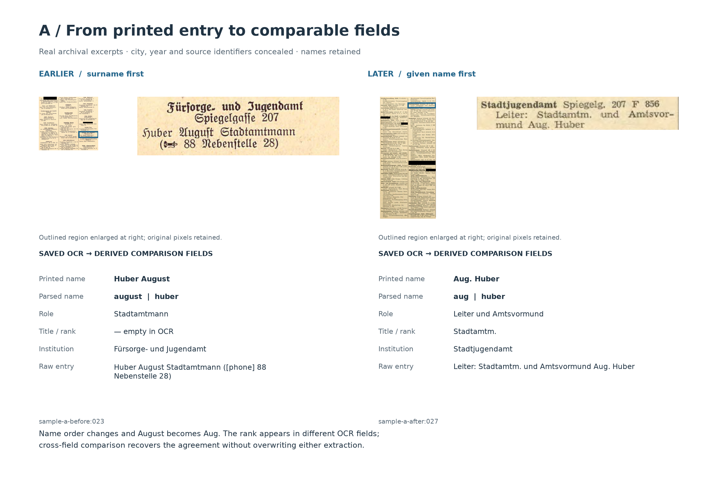
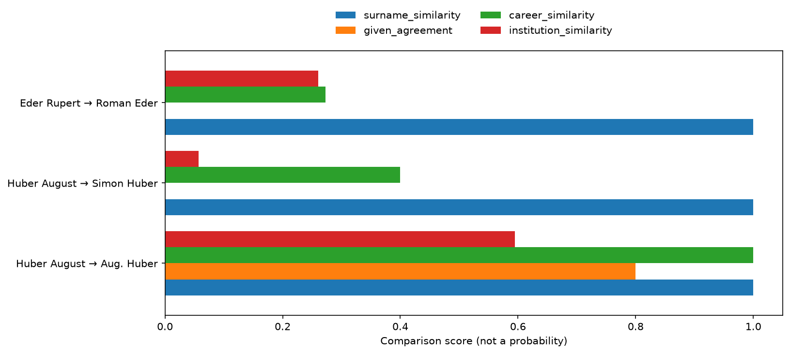
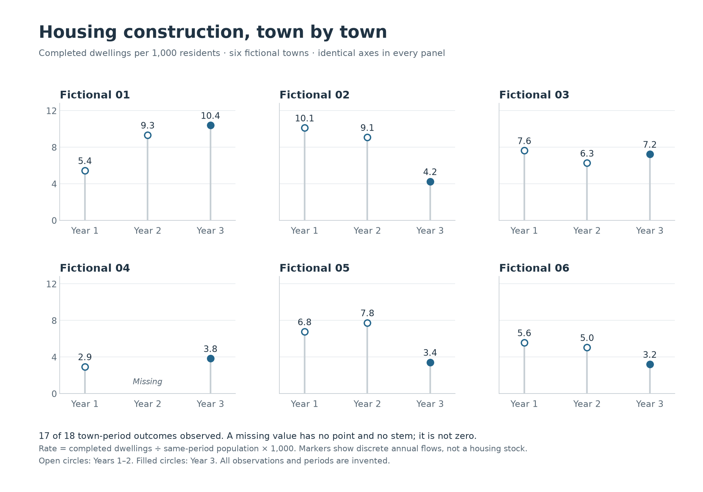

# Tracing people and their positions across address books

We want to **find the same people in different editions of historical address books and see whether their positions change**. For each person, we compare which public office they belong to and what role or rank is recorded in an earlier and a later book.

The address-book sections used here list public institutions and their staff, alongside names, job titles and duties. They are scanned pages, so we first use **OCR (optical character recognition)** to turn the printing into text and structured fields. We preserve the original wording so that each extracted name and position can be checked against the page.

Before comparing positions, we have to establish whether two entries describe the same person. One book may print **Huber August**, while another uses **Aug. Huber**. Names can be abbreviated or reordered, and different people can share a surname. We therefore compare names together with ranks and office information, inspect competing possible matches, and record why a link is accepted or rejected.

**[Read the executed walkthrough](walkthrough.ipynb).** This small example follows two selected cases from four real page excerpts: one where the evidence supports linking the entries, and one where a shared surname is misleading. It shows the printed pages, extracted fields, identity decisions and recorded positions side by side. Names remain visible; the city, exact years and source identifiers are concealed.

## What this example demonstrates

An **entry** is one printed listing, not necessarily a distinct person. A **candidate pair** is an earlier and a later entry that might describe the same person. We call each of the two earlier entries chosen for the walkthrough an **anchor**.

| Input or comparison | Scope |
|---|---|
| Redacted archival excerpts | 4 |
| Extracted entries | 137: 77 earlier, 60 later |
| Search for possible matches | Compare all 77 earlier entries with all 60 later entries from the same town, represented by a neutral label |
| Pairs with sufficiently similar surnames | 15, including 3 involving the two selected anchors |
| Decisions presented | 2 selected earlier entries |

The excerpts are not complete lists of municipal staff. All 15 candidate pairs, including conflicting given names, contribute to competition; only the two anchors receive reported decisions.

| Earlier entry | Later candidate | Illustrated decision |
|---|---|---|
| Huber August | Aug. Huber | Accepted: compatible abbreviation and rank/office evidence |
| Eder Rupert | Roman Eder | Rejected: conflicting given names and different careers |

For Huber, the earlier entry records the rank **Stadtamtmann**. The later entry records the same rank in abbreviated form and also describes his role as **Leiter und Amtsvormund**. Linking the entries lets us compare these descriptions of his position. A difference in what the books record does not by itself establish that his actual duties changed; that requires further evidence.

The cases were chosen to contrast these situations, not sampled to estimate performance. They use previously recorded review judgements and the source evidence shown here. **The sample does not document the original reviewer, review date or additional corroboration.** Separately storing labels does not make this an independent validation exercise. The prior review reportedly found no later match for Rupert Eder; these excerpts only support inspecting and rejecting the displayed Roman Eder candidate.

In the wider research, tracing people and their positions helps investigate how administrative personnel persist or change through political transitions, and how that continuity relates to later economic outcomes. The [separate outcome notebook](https://github.com/ikarurs/synthetic-record-linkage/blob/fictional-outcomes/outcomes.ipynb) uses entirely fictional data to illustrate how person links could eventually support municipal summaries and outcome analysis.

## See the process

**Scanned page → extracted names and positions → possible matches across books → compare alternatives → decide whether it is the same person → inspect the recorded positions**

The first figure places the original printed detail beside its actual saved OCR fields. Read across the rows: name order changes, August becomes Aug., and the same rank lands in different role/title fields. Blue boxes are manually reviewed display windows, not OCR detections.



The evidence figure separates similarity from the decision. Its lower panels show both directions of competition: Aug. Huber versus Simon Huber for the earlier anchor, and Huber August versus Huber Ludwig for the proposed later entry. The forward margin is 0.320; the reverse margin is about 0.314. Both exceed the illustrative 0.08 requirement.



The walkthrough also includes the [Eder source comparison](outputs/source_b.png), the actual OCR prompt and response excerpt, one complete score calculation, full review explanations, and PNG/SVG exports. Full excerpts: [A earlier](data/pages/sample-a-before.png), [A later](data/pages/sample-a-after.png), [B earlier](data/pages/sample-b-before.png), [B later](data/pages/sample-b-after.png).

## Continue with fictional municipal outcomes

**You are on the `fictional-outcomes` branch. [Open its executed outcome notebook](outcomes.ipynb).** Once person links have been validated, they can be summarised by town and compared with municipal outcomes. This separate exercise uses 72 invented people across six fictional towns and 18 invented town-period observations, with one deliberately missing construction value. It cannot be joined to the historical people or town above.

The figures show [decision shares with counts and denominators](outputs/fictional_decisions.png), [housing construction per 1,000 residents on common scales](outputs/fictional_outcomes.png), and [a scenario where all pending reviews become accepted](outputs/fictional_sensitivity.png). The scenario holds outcomes fixed; it is not an uncertainty interval or causal effect. All three figures have PNG and SVG exports.



Reproduce from the repository root with `python -m jupyter nbconvert --execute --to notebook --inplace outcomes.ipynb`.

## Reproduce offline

Tested with Python 3.13.7. From the repository root:

```bash
python -m venv .venv
# Windows: .venv\Scripts\Activate.ps1
# macOS/Linux: source .venv/bin/activate
python -m pip install -r requirements.txt
python run.py
python -m unittest -v
python -m jupyter nbconvert --execute --to notebook --inplace walkthrough.ipynb
```

After installation, these commands need no credentials or API calls. They verify the redacted-image, prompt, schema and configuration hashes, replay actual saved Gemini responses, and regenerate the tables and figures. Expected results are the counts above, one accepted focal link and one `no_link`. `python run.py` resolves files relative to its own directory; execute notebooks from the repository root.

Optional live OCR is explicit and incurs API charges:

```bash
# Set GOOGLE_API_KEY securely in your environment; never commit it.
python ocr.py --live
```

`--page sample-a-before` reruns one image; `--model MODEL` selects a compatible model. The API reads only the redacted image, prompt and schema, never the other period or review labels. Responses are checked before replacement and may differ between runs. See Google's [GenerateContent documentation](https://ai.google.dev/api/generate-content).

## Methods and limits

Name order follows a visually checked page convention, overridden by explicit commas. Names are lowercased; umlauts become ae/oe/ue, ß becomes ss, and punctuation is removed. Abbreviated given names are compared as prefixes, never expanded into invented names. Mixed-order and compound names outside the focal examples are not all manually validated.

Surname, rank/role and office comparisons use Python's `difflib.SequenceMatcher` ratio: twice the number of characters in matching blocks divided by the combined string lengths. This measures textual similarity, not shared meaning. Empty fields contribute zero. Surname similarity must reach 0.82. Exact given names score 1, compatible multi-letter prefixes 0.8, single initials 0.5, and conflicts or missing names 0. Rank abbreviations are normalised using an explicit short list. All four role/title field combinations are compared, retaining the highest similarity. Office similarity compares the normalised full heading path.

The illustrative ranking score is **0.55 × surname + 0.25 × given name + 0.20 × max(rank/role, office)**. These weights and the thresholds are teaching choices, not fitted or calibrated estimates. The walkthrough calls the same functions as the pipeline to show the strings, component scores and weighted contributions.

Acceptance requires score ≥ 0.84, compatible name evidence, strict preference in both directions, margins ≥ 0.08 where alternatives exist, and page confidence ≥ 0.8. Conflicts reject; initial-only or missing names remain under review; ties never pass. Both comparison directions use the complete blocked excerpt pool, including given-name conflicts. A margin is the proposed pair's score minus its strongest alternative's score. A missing alternative produces a blank margin and **“No competing candidate”**, not a comparison against zero; the other safeguards still apply. Reverse margins can be negative when a rival wins. Only accepted decisions receive a linked `right_id`.

A score is not a probability. Gemini's page confidence is self-reported, not measured extraction accuracy. A given-name conflict can score at most 0.75 under these weights, already below 0.84; the explicit conflict rule explains the rejection and still protects against conflicts if the threshold is lowered. Removing the guard alone cannot change these displayed decisions.

This standalone teaching implementation does not reproduce the research workflow's entity assembly, richer name-order handling, name-frequency evidence, fitted models or town-separated validation. Selected cases cannot estimate general accuracy, population continuity or economic effects. A missing observed link is not evidence of departure or its cause.

The [source PDF](data/source-excerpts.pdf) contains only redacted raster images, without original image files, text layers or source metadata. Neutral identifiers are used in all public outputs; the private source map is excluded. Concealing direct identifiers cannot guarantee that retained names and context are untraceable through independent research.

## Audit files

| File | Contents |
|---|---|
| `data/ocr/` | Actual saved responses, full transcriptions and hash/model metadata |
| `outputs/records.csv`, `outputs/pages.csv` | All extracted entries and page audit (`people` is a legacy column meaning entries) |
| `outputs/comparison_pool.csv` | All 15 blocked pairs; blank `case_id` means a supporting earlier entry, not a focal anchor |
| `outputs/candidates.csv` | The three focal candidate pairs |
| `outputs/matches.csv` | Two decisions, candidate counts, competitor IDs/scores, both margins and applied thresholds |
| `data/reviewed_pairs.csv`, `outputs/review_comparison.csv` | Previously recorded judgements and their comparison with pipeline decisions |
| `linkage.py`, `visualise.py` | Matching rules and reproducible figures |

`candidate_count` and `reverse_candidate_count` include the proposed pair. `runner_up_id/score` identify the strongest other later entry; `reverse_runner_up_id/score` identify the strongest other earlier entry. With no alternative, both the competitor fields and corresponding margin are blank in CSV (`None` in Python). The two focal cases are defined in `data/anchors.csv`, separately from review labels.

Prepared with AI coding assistance for Urs Maier. This repository runs independently of the private research project. The outcome branch's invented towns and observations cannot be joined to the real historical people or source town.
