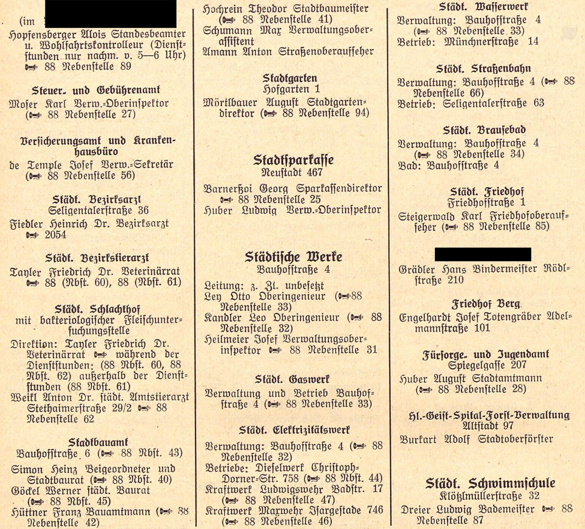
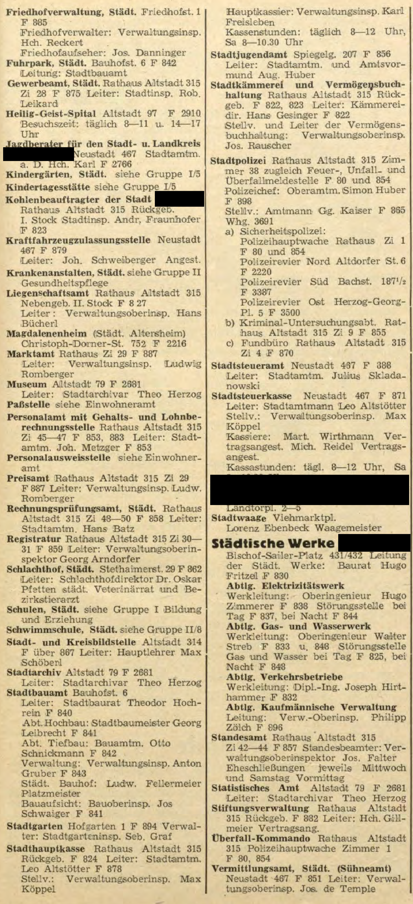

# From archival pages to matched personnel

**You are on the `fictional-outcomes` branch. [Open its executed outcome notebook](outcomes.ipynb).** It aggregates 72 invented personnel decisions across six fictional towns, joins 18 housing observations, preserves a missing value and plots construction rates. Run it from the repository root with `python -m jupyter nbconvert --execute --to notebook --inplace outcomes.ipynb`. The fictional data are unrelated to the archival town below.

**[Open the executed walkthrough](walkthrough.ipynb)** to see the actual source excerpts, their OCR and the matching evidence. The [fictional-outcomes branch](https://github.com/ikarurs/synthetic-record-linkage/tree/fictional-outcomes) contains a separate, small municipal-outcomes exercise.

This standalone example follows two reviewed cases from historical administrative-record work. The four images are **real scanned page excerpts**. Personal names and printed typography are retained. City, year, original page numbers, source filenames and identifying location headings are concealed or cropped out. Neutral labels replace source identifiers throughout the code, OCR and outputs.

| Example | Earlier source | Later candidate | Reviewed result |
|---|---|---|---|
| A | Huber August | Aug. Huber | Same person: compatible abbreviated name and closely related youth-welfare office |
| B | Eder Rupert | Roman Eder | Different people: surname agrees, given names and careers do not |

These are reviewed identity judgements, not manufactured ground truth. In the original review, no later match was found for the second anchor. The public excerpts illustrate the rejected candidate; they do not reproduce the complete roster search or establish that nobody else on those pages reappears.

## Source pages

The original page layout, paper, Fraktur and line breaks remain visible. Click an image to zoom.

| Earlier source, example A | Later source, example A |
|---|---|
| [](data/pages/sample-a-before.png) | [](data/pages/sample-a-after.png) |

The [four-page source PDF](data/source-excerpts.pdf) contains only the redacted raster images; original images, text layers and PDF metadata are not embedded. The private source map and redaction preparation files are not part of this repository. This conceals direct source identifiers; retained historical names and other context are not a guarantee against identification through independent research.

## Follow the pipeline

1. **OCR:** Gemini reads each redacted image and returns a transcription plus named entries, roles, titles and institution paths. It sees neither the original source nor matching labels.
2. **Assemble:** preserve each raw name and entry, attach the neutral page ID and image hash, and derive comparison fields. Unseen headings remain unknown.
3. **Find candidates:** search later entries in the same neutral town, using surname similarity. Resolve order from the visually reviewed page convention or an explicit comma; do not expand abbreviated names.
4. **Compare:** inspect surname and given-name evidence, institutional context, and rank/role text. A common surname alone does not establish identity.
5. **Decide and review:** require enough evidence, a clear margin and mutual preference. Compare the resulting decisions with the independently saved review labels.

`data/ocr/` contains **actual saved Gemini responses**, with the model, capture time, token usage and image/prompt/schema hashes. `python run.py` verifies and replays them offline. It does not claim to perform a new OCR run. The notebook shows the saved transcription beside the source evidence.

## Run

Tested with Python 3.13.7:

```bash
python -m venv .venv
# Windows: .venv\Scripts\Activate.ps1
# macOS/Linux: source .venv/bin/activate
python -m pip install -r requirements.txt
python run.py
python -m unittest -v
python -m jupyter nbconvert --execute --to notebook --inplace walkthrough.ipynb
```

The CLI resolves files relative to its own directory. After installation the saved-response path is offline and needs no credentials. Live OCR is optional and incurs API charges:

```bash
# Set GOOGLE_API_KEY securely in your environment; never commit it.
python ocr.py --live
python run.py
```

`--page sample-a-before` reruns one image; `--model MODEL` selects another compatible model. Fresh responses may differ. Each response is checked before replacing its saved file; source or prompt changes invalidate the cache. The API request follows Google's [GenerateContent documentation](https://ai.google.dev/api/generate-content).

## What the small matcher does

Within-town surname similarity must be at least 0.82. The illustrative ranking score is `0.55 surname + 0.25 given + 0.20 max(career, institution)`. Exact given names score 1; a compatible multi-letter abbreviation scores 0.8; a single initial scores 0.5. Conflicting given names reject a candidate. Initial-only or missing given names stay under review.

Acceptance needs score ≥ 0.84, margin ≥ 0.08 on both sides, mutual best choice and page confidence ≥ 0.8. Ties never pass, even with a zero margin. Only accepted decisions populate `right_id`. A score is not a probability, and the model's self-rated OCR confidence is not measured extraction accuracy.

**This is an inspectable teaching implementation, not the complete research matcher.** It uses reviewed page-level name order and a simple rule, without fitting a model on two examples. The research workflow additionally handles within-book entity assembly, richer name-order context, name-frequency evidence, fitted models and town-separated validation. Crops can omit headings or other candidates, and OCR can misread names. This sample therefore reports cases and evidence, not a general accuracy estimate or a continuity rate.

## Files

| File | Purpose |
|---|---|
| `ocr.py` | Live image extraction and hash-checked saved-response replay |
| `linkage.py` | Name order, candidate generation, evidence and decisions |
| `run.py` | Offline pipeline and audit tables |
| `walkthrough.ipynb` | Executed source → OCR → matching walkthrough |
| `data/anchors.csv` | Which two earlier entries to examine; no outcome labels |
| `data/reviewed_pairs.csv` | Separately stored human-review decisions |
| `outputs/` | Extracted records, candidates, decisions and review comparison |

Prepared with AI coding assistance for Urs Maier. The repository runs independently: no imports, submodules, paths, credentials or services from the private research project are required. The outcome branch uses entirely fictional data and does not attach invented outcomes to the historical people or source town.
